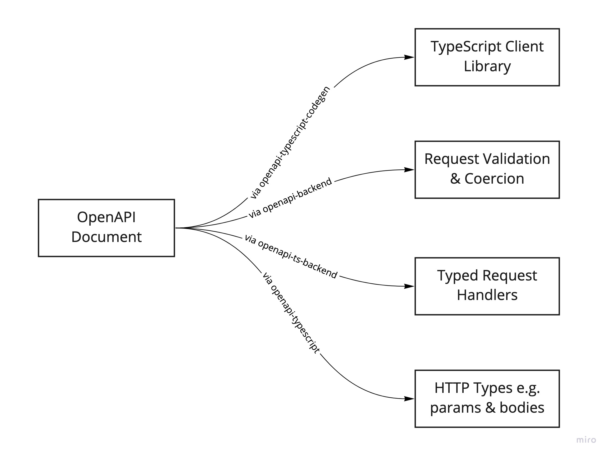

# OpenAPI ❤️ TypeScript ❤️ Express

An example of how to use `openapi-ts-backend` and `openapi-typescript-codegen` to create typed request handlers that integrate with Express and a TypeScript client library.

## Why is this interesting?

- openapi.yaml as the single source of truth
- Automatic generation of request and response types
- Automatic validation of request and response data
- Automatic coercion of request data e.g. numeric query parameters
- Automatic generation of a TypeScript client library



## Run the server

```sh
yarn dev
```

## Run the tests

```sh
yarn test
```

## Update the Schema:

- Update the openapi.yaml file.
- Run `yarn generate:all`.
- Request handlers and the client library will now be typed with the changes.

## Notes / Gotchas / Disclaimer

### unknown format "int32"

- unknown format "int32" ignored in schema at path "#/properties/limit" (will be fixed with upcoming ajv-format release)

### Additional coercions

It would be nice if (for example) date value could be coerced in to Date objects.

### Type safety of Headers

At the moment, headers are set by mutating the response object. This makes it difficult to enforce that one type of response should have certain headers, while the others do not. If the request handler could return the entire response, including headers, then it would be easier to type check that the headers match the body.

Additonally, type safety is currently lost if an endpoint allows multiple responses, some with headers and some without.
